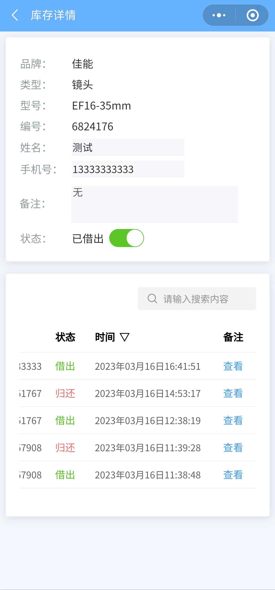
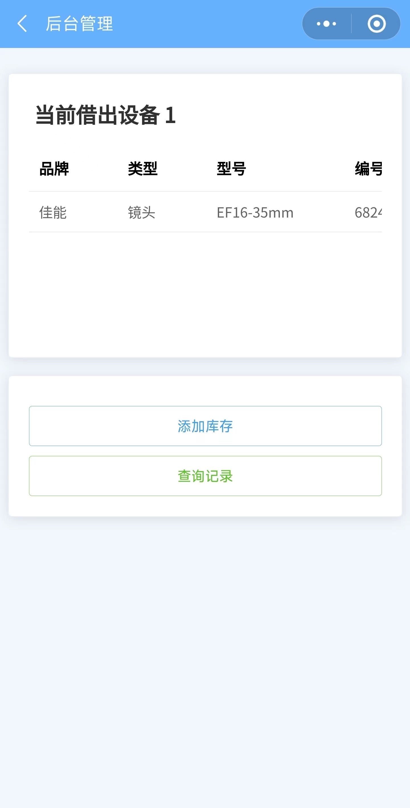
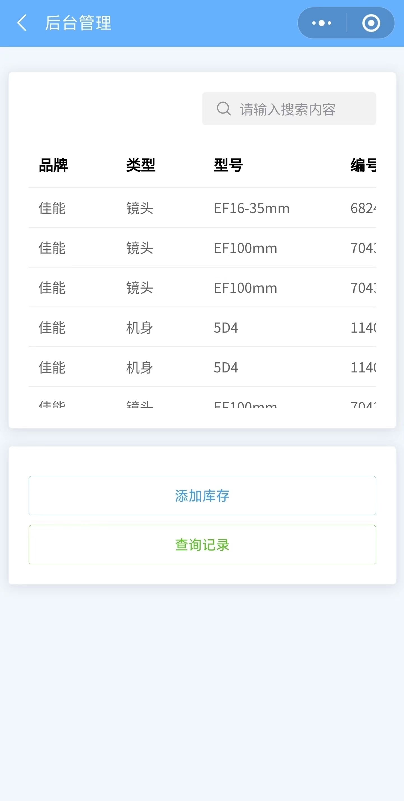

## 前言

学校摄影社的设备管理起来太麻烦，需要我们帮他们做一个摄影设备管理的小程序，于是WMS就诞生了。
WMS算是我的第一个正式项目，虽然好像也挺简单的，由YuYa大佬牵头，我在其中学到了不少东西，写的不好，还有很多改进的空间，希望大佬们提出宝贵的意见，不胜感激。 -- Xiaofan

# ⚙ WMS

<a href="https://github.com/xfanweb/WMS/releases/latest"></a>

WMS是一款使用uni-app开发的轻量级摄影设备管理小程序。

## 🌈 扫码体验


## 🎉 功能简介

* 扫描设备上的二维码即可进行借还操作
* 支持查看该设备的历史借还记录
* 该设备历史借还记录支持通过姓名手机号进行模糊搜索
* 附带简易的后台管理
* 查看当前已借出设备的信息
* 添加库存
* 查询所有设备的历史记录支持模糊搜索
##### ps：你问我为什么这么少功能？因为便宜...

## 💻 安装说明

1. 克隆仓库
```powershell
git clone -b master https://github.com/xfanweb/WMS.git
```
2. 安装依赖
```powershell
npm install
```
3. 打开HBuilder X导入项目
4. 打开manifest.json获取自己的AppID同时配置好自己的微信小程序AppID
5. 右键uniCloud文件夹云服务初始化
6. 点击运行到小程序模拟器安装流程到此结束

## 📷 截图





